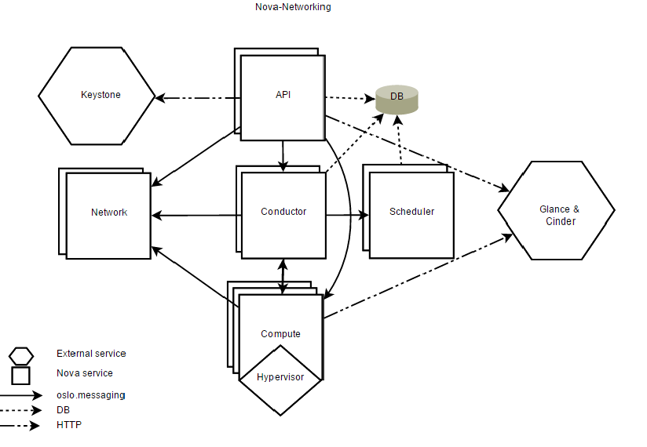
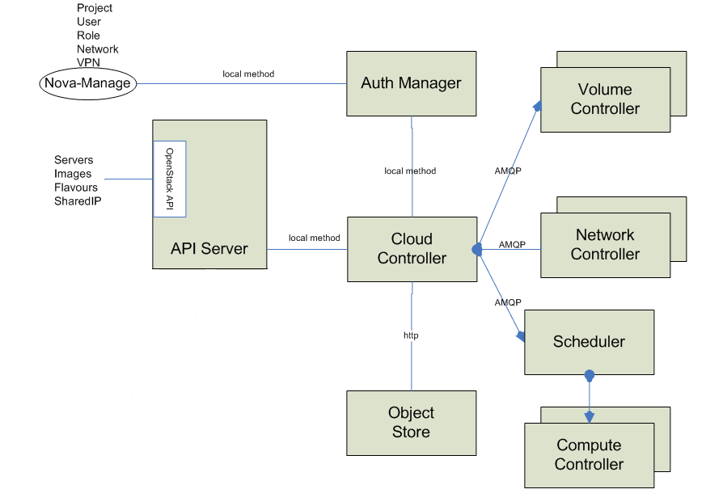
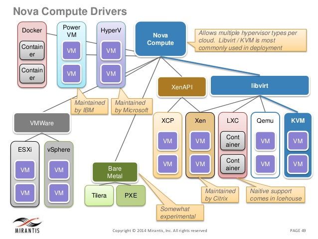
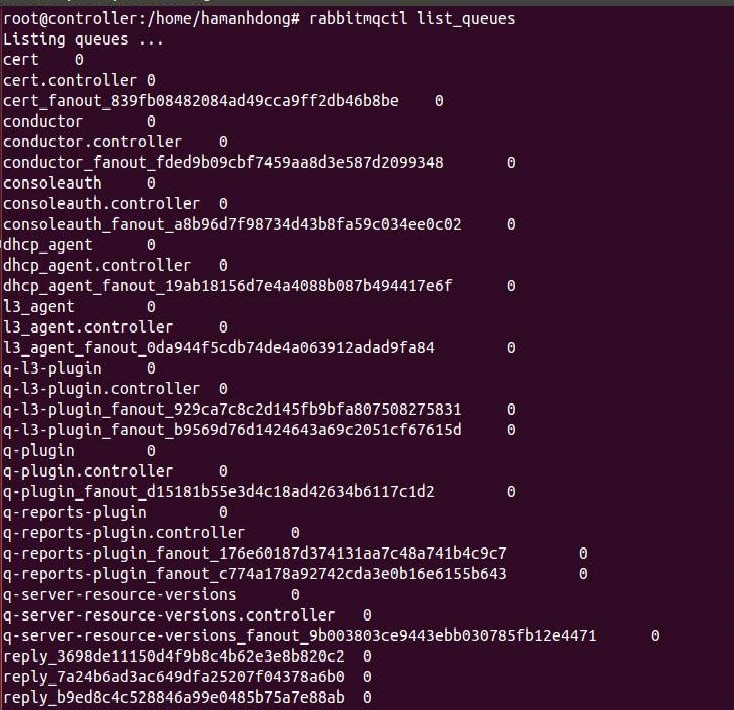

##Tìm hiểu về dịch vụ OpennStack Compute - Nova

- [1. Tóm tắt về dịch vụ OpenStack Compute](#overview)
- [2. Các service của OpenStack Compute](#service)
    * [2.1 API](#api)
    * [2.2. Compute core](#compute_core)
    * [2.3. Networking for VMs](#network)
    * [2.4. Console interface](#console)
    * [2.5. Command-line clients and other interfaces](#command_line)
    * [2.6. Other components](#other_component)
- [3. Image and lauch instance](#lauch_instance)
    * [3.1 Image and instance](#3.1)
    * [3.2 Lauch instance](#3.2)
- [4. Xử lý khi nhận được request](#request)
- [5. Quotas](#quota)
    * [5.1 Đối với các project](#5.1)
    * [5.2 Đối với các user của project](#user_project)


(Tài liệu này tìm hiểu theo kiến trúc và chức năng của các thành phần Nova trong bản OpenStack Mitaka)


<a name="overview"></a>
##1 Tóm tắt về dịch vụ OpenStack Compute
Sử dụng OpenStack Compute để lưu trữ và quản lý hệ thống điện toán đám mây. OpenStack compute là 1 phần quan trọng của hệ thống cung cấp dịch vụ hạ tầng điện toán đám mây IaaS (Infrestructure-as-a-Service). Các module chính được viết bằng Python.



OpenStack Compute tương tác với OpenStack Identity (Keystone) để xác thực người dùng, tương tác với dịch vụ OpenStack Image (Glance & Cinder) để lấy đĩa cài hệ điều hành, và OpenStack Dashboard  để cung cấp dịch vụ tương tác cho người sử dụng và giao diện quản trị. Truy cập vào Image bị giới hạn bởi các project và các người dùng, và quotas  giới hạn cho các project. OpenStack Compute có thể scale lên phần cứng chuẩn (mở rộng phần cứng vật lý), và tải xuống image để chạy thực thể.



Một số thành phần chính của OpenStack Compute:

<b>+ Cloud controller:</b> biểu diễn trạng thái tổng thể và tương tác với các thành phần khác. Các máy chủ API đóng vai trò như các web service front-end cho Cloud Controller.
Compute controller cung cấp các máy chủ tính toán có chứa luôn cả dịch vụ Compute.

<b>+ Object storage:</b> là 1 thành phần cung cấp các dịch vụ lưu trữ, bạn có thể sử dụng OpenStack Object Storage để thay thế.

<b>+ Auth manager:</b> cung cấp dịch vụ xác thực và ủy quền khi sử dụng hệ thống Compute. Bạn cũng có thể sử dụng OpenStack Identity như 1 dịch vụ xác thực riêng biệt để thay thế.

<b>+ Volume controller:</b> cung cấp các khối lưu trữ 1 cách nhanh chóng và thường xuyên cho các máy chủ compute.

<b>+ Network controller:</b> cung cấp các mạng ảo để cho phép các máy chủ compute tương tác với nhau và với mạng công cộng. Bạn cũng có thể sử dụng OpenStack Networking để thay thế.

<b>+ Scheduler:</b> được sử dụng để lựa chọn máy compute phù hợp nhất để triển khai 1 instance.

Các thành phần của nova được liên kết với nhau bằng Queue Server.Ở đây, Queue Server dùng rabbitmq, một gói phần mềm chuyên làm nhiệm vụ chuyển request đến đích tương ứng. Do các thành phần của nova đều hoàn toàn độc lập với nhau, có thể chạy trên các máy khác nhau, và số lượng mỗi thành phần là không hạn chế, trong trường hợp có 1 máy bị hỏng, rabbitmq sẽ chọn ra 1 máy khác có cùng dịch vụ để gởi request. Trạng thái của toàn bộ hệ thống sẽ được lưu trong 1 csdl. Cloud controller giao tiếp với các internal object sử dụng HTTP, nhưng nó giao tiếp với các dịch vụ scheduler, network controller và volume controller sử dụng AMQP (Advance Message Queuing Protocol). Để tránh bị block 1 thành phần trong khi đợi 1 response thì Compute sử dụng các cuộc gọi không đồng bộ, với 1 callback sẽ được kích hoạt khi nhận được 1 response. Một hệ điều hành ảo có thể được format và mount 1 thiết bị lưu trữ như vậy.

<b>Ảo hóa (Hypervisor)</b>

Compute điểu khiển ảo hóa thông qua 1 máy chủ API. Để chọn hypervisor tốt nhất để sử dụng khá khó khăn, bạn phải lấy tài nguyên, các tính năng được hỗ trợ, và yêu cầu thông số kỹ thuật cần thiết trong tài khoản. Tuy nhiên, phần lớn các phát triển của OpenStack sử dụng KVM và Xen-based.

<b>Projects, users và roles</b>
Hệ thống Compute được thiết kế để phục vụ nhiều người dùng khác nhau trong các project trên 1 hệ thống được chia sẻ, và dựa trên các vai trò truy cấp. Các role kiểm soát các hoạt động mà 1 user được phép thực hiện.
</br>
Các project bao gồm một VLAN riêng, và các volume, instance, images, keys, và các user. Một user có thể chỉ định project bằng cách gắn thêm project_id vào khóa truy cập (access key) của họ. Nếu không có project nào được chỉ định trong API request, Compute sẽ chọn 1 project có ID tương tự như user.
</br>
Đối với các project, bạn có thể sử dụng quota control để hạn chế:

- Số lượng volume có thể được triển khai 
- Số nhân xử lý và dung lượng Ram có thể được phân bổ
- Floating IP cho bất kỳ instance nào khi nó được chạy. Điều này cho phép các instance có địa chỉ IP được public để truy cập.
- Fixed IP đến cùng 1 instance so với private Ip của instance đó. Điều này cho phép các instance có địa chỉ IP để truy cập public và private.

(Mỗi instance đều có 1 địa chỉ IP private và fixed, và có thể có 1 địa chỉ IP public hoặc floating. Private IP được dùng để giao tiếp giữa các instances, public Ip dùng để nối ra mạng ngoài của cloud, bao gồm cả kết nối tới internet.
Khi bạn chạy 1 instance thì instance đó sẽ được gán 1 private Ip và Ip này sẽ giữ nguyên kể cả khi bạn khởi động lại hệ thống, nó chỉ mất khi bạn xóa instance đó.)


Các role kiểm soát các hành động của 1 user được phép thực hiện. Theo mặc định, hầu hết các hành động không yêu cầu 1 role đặc biệt, nhưng bạn có thể cấu hình chúng bằng cách sửa file policy.json để thêm role cho user. Ví dụ, 1 luật có thể được định nghĩa để 1 user phải có quyền admin để có thể phân bổ 1 địa chỉ IP public.
</br> 
Một project hạn chế người dùng truy cập đến các image cụ thể. Mỗi user được gán 1 tên sử dụng và mật khẩu. 1  keypair cấp quyền truy nhập đến 1 instance được kích hoạt cho mỗi user, nhưng quota được thiết lập để cho mỗi project có thể kiểm soát sự tiêu thụ tài nguyên trên phần cứng vật lý có sẵn.
</br></br>
<b>Block storage</b>
</br>
OpenStack cung cấp 2 lớp của block storage: ephemerak storage (lưu trữ ngắn hạn) và persistent volume (volume dài hạn).
</br></br>
   * <b>Ephemeral storage:</b> bao gồm 1 root ephemeral storage và 1 additional ephemeral volume.
   Các đĩa gốc được liên kết với 1 instance, và chỉ tồn tại khi instance này vẫn còn “sống”. Nói chung là nó được sử dụng để lưu trữ các hệ thống tập tin gốc của 1 instance, nó khong bị mất đi khi reboot lại hệ điều hành, nhưng sẽ bị mất khi 1 instance bị xóa. Tổng số root ephemeral volume được xác định bơi flavor của 1 instance.

   Ngoài ephemeral root volume, tất các các kiểu mặc định của flavor, trừ m1.tiny có kích thước nhỏ nhất, thì đều cung cấp thêm 1 additional ephemeral volume có kích thước từ 20-160 GB (giá trị này có thể cấu hình để phù hợp với môi trường). Nó được biểu diễn như 1 block device gốc không có các bảng partition hay các file system. 
</br></br>
   * <b>Persistent volume:</b> được biểu diễn thông qua 1 persistent virtualized block device của bất kỳ 1 instance riêng biệt nào, và nó được cung cấp bởi OpenStack Block Storage.
   Chỉ có 1 cấu hình instance đơn lẻ mới truy cập được vào 1 persistent volume. Multiple instance không thể truy cập vào persistent. Kiểu cấu hình này yêu cầu phải có 1 hệ thống mạng gốc các file systemt  để cho phép multiple instance có thể truy cập vào persistent volume. Những hệ thống này có thể được xây dựng trong 1 OpenStack cluster, hoặc được cung cấp từ bên ngoài, nhưng phần mềm OpenStack không hỗ trợ tính năng này.
</br></br>

<b>Building blocks</b></br>
Trong OpenStack, hệ điều hành cơ sở thường được copy từ 1 image được lưu trữ trong dịch vụ OpenStack Image. Đây là trường hợp phổ biến nhất và kết quả trong 1 ephemeral instance bắt đầu từ 1 trạng thái mẫu được biết đến và mất tất cả các trạng thái trước đó khi máy ảo bị xóa. Nó cũng có thể đặt 1 hệ điều hành trên 1 persistent volume trong hệ thông OpenStack Block Storage volume. Để xem danh sách các image sẵn có trên hệ thống của bạn, bạn chạy lệnh :
```sh
root@controller:/home/hamanhdong# nova image-list
+--------------------------------------+-----------------------------+--------+---------+
| ID                                   | Name                        | Status | Server  |
+--------------------------------------+-----------------------------+--------+---------+
| aee1d242-730f-431f-88c1-87630c0f07ba | Ubuntu 14.04 cloudimg amd64 | ACTIVE |         |
| 0b27baa1-0ca6-49a7-b3f4-48388e440245 | Ubuntu 14.10 cloudimg amd64 | ACTIVE |         |
| df8d56fc-9cea-4dfd-a8d3-28764de3cb08 | jenkins                     | ACTIVE |         |
+--------------------------------------+-----------------------------+--------+---------+
```
Trong đó: </br>
<b>ID: </b>Được tự động tạo ra cho image qua UUID</br>
<b>Name: </b>Không cần theo mẫu cụ thể, có thể là cả tên người đặt cho image cũng được.</br>
<b>Status: </b>trạng thía của image, nếu là active nghĩa là có sẵn để sử dụng.</br>
<b>Server: </b>Đối với các image được tạo ra từ snapshot thì đây là UUID của instance được dùng để snapshot. Còn đối với các image tải lên thì phần này để trống.
</br></br>
Các mẫu phần cứng ảo được gọi là flavor. Theo cài đặt mặc định sẽ có 5 flavor được cung cấp. Đây là những cấu hình bởi admin user, tuy nhiên các hành vi có thể được thay đổi bằng cách xác định lại các điều khiển truy cập cho compute_extension: flavormanage trong file /etc/nova/policy.json trên máy chủ compute-api.
</br>
Dưới đây là danh sách 5 flavor sẵn có trên hệ thống:
</br>
```sh
root@controller:/home/hamanhdong# nova flavor-list
+-----+-----------+-----------+------+-----------+------+-------+-------------+-----------+
| ID  | Name      | Memory_MB | Disk | Ephemeral | Swap | VCPUs | RXTX_Factor | Is_Public |
+-----+-----------+-----------+------+-----------+------+-------+-------------+-----------+
| 1   | m1.tiny   | 512       | 1    | 0         |      | 1     | 1.0         | True      |
| 2   | m1.small  | 2048      | 20   | 0         |      | 1     | 1.0         | True      |
| 3   | m1.medium | 4096      | 40   | 0         |      | 2     | 1.0         | True      |
| 4   | m1.large  | 8192      | 80   | 0         |      | 4     | 1.0         | True      |
| 5   | m1.xlarge | 16384     | 160  | 0         |      | 8     | 1.0         | True      |
+-----+-----------+-----------+------+-----------+------+-------+-------------+-----------+
```

<a name="service" ></a>
##2. Các service của OpenStack Compute
<a name="api"></a>
###2.1.  API
<b>Nova-api service:</b> chấp nhận và phản hồi với người dùng cuối yêu cầu API Compute. Nó hỗ trợ các dịch vụ OpenStack Compute API, và Admin API đặc biệt để cho người dùng có đặc quyền thực hiện các hành vi chính. Nó thực thi một số chính sách và khởi tạo các hoạt động cùng nhau, ví dụ như chạy 1 instance.
Theo mặc định, nova-api lắng nghe trên cồng 8774 đối với OpenStack API.

<b>Nova-api-metadata service:</b> chấp nhận các yêu cầu metadata từ các instance. Nova-api-metadata service thường được sử dụng khi bạn chạy ở chế độ đa máy chủ (multi-host) với cài đăth nova-network

<a name="compute_core"></a>
###2.2. Compute core



<b>Nova-compute service:</b> là 1 daemon tạo ra và chấm dứt các thể hiện của máy ảo thông qua các API của công nghệ tạo máy ảo đó. Ví dụ

- XenAPI cho XenServer/XCP
- Libvirt cho KVM hay QEMU
- VMwareAPI cho VMware

Tiến trình này khá phức tạp, về cơ bản, các daemon chấp nhận các hoạt động từ hàng đợi và thực hiện một loạt các lệnh hệ thống như chạy 1 máy ảo KVM và cập nhật trạng thái của nó trong database.


<b>Nova-scheduler service:</b> lấy một yêu cầu tạo máy ảo từ hàng đợi và xác định máy chủ compute mà nó chạy.


<b>Nova-conductor module:</b> trung gian tương tác giữa nova-compute service và database. Nó giúp loại bỏ các truy cập trực tiếp từ các nova-compute service đến database. Nova-conductor module chia theo chiều ngang, nghĩa là bạn có thể chạy nhiều instance của nova-conductor trên các máy khác nhau khi cần thiết để mở rộng thêm mục đích sử dụng. Tuy nhiên, không triển khai module này trên các nút có dịch vụ nova-compute chạy để thuận tiện cho việc di chuyển hay mở rộng sau này.</br>
Hiện nay, OpenStack đang cố đẩy thêm các thành phần liên quan trên nova-compute sang nova-conductor để thuận tiên hơn cho sự di chuyển (migrations) hay mở rộng kích thước. Và để cho nova-conductor sẽ thực hiện các hoạt phức tạp, để đảm bảo sự phát triển và xử lý lỗi tốt hơn.
</br>
<b>Nova-cert module:</b> Một máy chủ daemon phục vụ dịch vụ Nova Cert cho chuẩn X509. Được sử dụng để tạo ra các giấy chứng nhận cho euca-bundle-image. Nó chỉ cần thiết cho EC2 API.

<a name="network"></a>
###2.3. Networking for VMs
<b>Nova-network worker daemon:</b> tương tự như nova-compute, nó chấp nận nhiệm vụ kết nối mạng từ hàng đợi và điều khiển mạng. Nhiệm vụ thực hiện là thiet lập các giao diện cầu nối hoặc thay đổi các luật IPtables.
</br>

<a name="console"></a>
###2.4. Console interface 
<b>Nova-consoleauth daemon: </b>dịch vụ này phải chạy trong giao diện proxy để hoạt động. Bạn có thể chạy các proxy của 1 trong 2 loại đối với 1 dịch vụ nova-consoleauth trong 1 cấu hình cluster duy nhất.
</br>
<b>Nova-novncproxy daemon:</b> cung cấp 1 proxy để truy cập chạy các instance thông qua 1 kết nối VNC. Hỗ trợ các client trên nền web với novnc.
</br>
<b>Nova-spicehtml5proxy daemon:</b> cung cấp 1 proxy để truy cập chạy các instance thông qua kết nối SPICE. Hỗ trợ các client trên nền web với HTML5
</br>
<b>Nova-xvpvncproxy daemon:</b> cung cấp 1 proxy để truy cập chạy các instance thông qua kết nối VNC. Hỗ trợ client Java OpenStack cụ thể.
</br>
<b>Nova-cert daemon:</b> chứng nhận X509 (trong nova-cert module)
</br>

<a name="command_line"></a>
###2.5. Command-line clients and other interfaces
<b>Nova client:</b> cho phép người dùng thực thi các lệnh như 1 quản trị viên được ủy quyền hay người dùng cuối.
</br>

**Note:** 1 số các service có các driver để cho người dùng có thể thay đổi cách thức service đó  thực hiện chức năng cốt lõi. Ví dụ nova-compute service hỗ trợ drives cho phép bạn có thể chọn loại hypervisor mà nó có thể sử dụng. Ngoài nova-compute thì còn có nova-network và nova-scheduler cũng có các driver này.

<a name="other_component"></a>
###2.6. Other components
<b>Queue:</b> một trung tâm để truyền các tin nhắn giữa các daemon. Thường được thực hiện với RabbitMQ, nhưng về mặt lý thuyết có thể được thực hiện với 1 hàng đợi tin nhắn AMQP chẳng hạn như Zero MQ.
Nova tạo ra một số loại hàng đợi thông điệp để tạo điều kiện giao tiếp giữa các daemon khác nhau. Chúng bao gồm: topics queue, fanout queue, và host queue. Topics queue sẽ cấp số cho các tin nhắn truyền đi vào các class riêng ứng với topic tương ứng của các worker daemon. Ví dụ, Nova sử dụng chúng để truyền các tin nhắn tới tất cả (hoặc một số) các volume daemon hay compute. Điều này cho phép Nova sử dụng worker đầu tiên có sẵn để xử lý tin nhắn. Host queue cho phép Nova gửi tin nhắn tới các dịch vụ riêng biệt trên các máy chủ cụ thể nào đó. Fanout queues hiện đang được sử dụng cho các thông báo của các dịch vụ phục vụ cho nova-scheduler worker.
Để xem các topic trong RabbitMQ, bạn sử dụng lệnh:

;

</br>
Để xem các hàng đợi được tạo ra trong RabbitMQ cho 1 node được cài đặt đơn giản, các bạn có thể dùng lệnh:
</br>
```sh
$ sudo rabbitmqctl list_queues
```
</br>
Kết quả:
</br>


</br>
<b>Nova database: </b>lưu trữ tất cả các trạng thái build-time và run-time cho 1 cơ sở hạ thầng điện toán đám mây, bao gồm:

- Các loại instance sẵn có
- Các instance trong sử dụng
- Các project

Về mặt lý thuyết, OpenStack Compute có thể hỗ trợ bất kỳ cơ sở dữ liệu nào mà SQL-Alchemy hỗ trợ. Csdl phổ biến là SQLite3 để thử nghiệm và phát triển công việc, MySQL và PostgreSQL.

Hiện nay, nova cần thêm 1 database mới, đó là nova-api database: được cấu hình và quản lý rất giống với nova database.
</br></br>

<a name="lauch_instance"></a>
##3. Image and lauch instance

<a name="3.1"></a>
###3.1 Image and instance
Các image máy ảo chứa 1 đĩa ảo có hệ điều hành trong đó. Disk image cung cấp các mẫu cho hệ thống file máy ảo. Dịch vụ Image điều khiển lưu trữ và quản lý các image.

Instance là các máy ảo riêng biệt chạy trên các node compute trong cloud. Các user có thể chạy rất nhiều các instance từ cùng 1 image. Mỗi instance được chạy từ 1 bản copy của các base image. Do đó, bất kỳ thay đổi nào trong các instance cũng k ảnh hưởng đến base image. User có thể tạo ra 1 snapshot, và xây dựng 1 image mới từ snapshot đó. Dịch vụ Compute điều khiển lưu trữ và quản lý các  instance, image, và snapshot.

Khi bạn chạy 1 máy ảo, bạn phải chọn 1 flavor (đại diện cho 1 tập hợp các tài nguyên ảo: RAM, CPU, Core ..). Flavor xác định số CPU ảo, lượng RAM sẵn có và kích thước bộ nhớ ephemeral. User phải chọn flavor trong list flavor có sẵn được xác định trên cloud của họ. OpenStack cung cấp 1 số các flavor xác định trước đó, bạn có thể chỉnh sửa hoặc thêm các flavor mới vào.

Bạn có thể thêm hoặc xóa các tài nguyên bổ sung từ 1 instance đang chạy, chẳng hạn như persistent volume storage hay các địa chỉ IP public. Các ví dụ được sử dụng trong docs này sử dụng dịch vụ Cinder-volume. Dịch vụ cinder-volume cung cấp persistent block storage (khối lưu trữ liên tục) thay vì các ephemeral storage (khối lưu trữ tạm thời) được cung cấp bởi các flavor instance được chọn.

Biểu đồ dưới đây cho thấy trạng thái hệ thống trước khi chạy 1 instance. Các image có sẵn ở trong dịch vụ Image. Bên trong cloud có 1 node compute chứa sẵn vCPU, bộ nhớ và tài nguyên ổ đĩa. Có dịch vụ Cinder-volume lưu trữ các volume được xác định sẵn.


<a name="3.2"></a>
###3.2 Lauch instance

Để chạy 1 instance, bạn chọn 1 image, flavor và 1 thuộc tính tùy chọn bất kỳ. Flavor được chọn sẽ cung cấp root volume (ký hiệu là vda trong hình), additional ephemeral storage (ký hiueje vdb trong hình). Trong ví dụ này, Cinder-volume được ánh xạ vào đĩa ảo thứ 3 của instance đang được triển khai (ký hiệu là vdc trong hình).


Dịch vụ Image sẽ copy image cơ bản từ các image được lưu trữ vào trong ổ đĩa local. Ổ đĩa này là ổ đĩa đầu tiên mà instance truy cập vào (ký hiệu vda trên hình). 
1 ổ đĩa ephemeral trống mới cũng được tạo, ổ đĩa này sẽ bị xóa khi bạn xóa instance.
Node compute kết nối tới cinder-volume thông qua iSCSI. Cinder-volume được ánh xạ vào ổ đĩa thứ 3 (ký hiệu vdc). Sau khi node compute quy định các vCPU và tài nguyên bộ nhớ, instance được boot lên từ volume vda. Sau đó instance chạy và thay đổi data trên các ổ đĩa (đánh dấu màu đỏ trên hình). Nếu volume storage nằm trên các mạng riêng biệt, tùy chọn my_block_storage_ip trong tập tim cấu hình sẽ “chỉ đường” cho image chuyển tới node compute.

Một số chi tiết trong ví dụ trên có thể khác trong môi trường triển khai của bạn. Ví dụ, bạn có thể sử dụng các back-end storage khác, hay các giao thức mạng khác. 1 biến thể phổ biến khác là  ephemeral storage được sử dụng cho volume vda và vdb trong hình trên có thể được hỗ trợ bởi 1 mạng lưới lưu trữ (network storage) hơn thay vì sử dụng 1 local disk.


<a name="request"></a>
##4. Xử lý khi nhận được request
</br>


(Hình trên là của phiên bản cũ, trong bản Mitaka, dịch vụ Quantum đã đổi sang tên mới là Neutron)
</br>
link: https://ilearnstack.com/2013/04/26/request-flow-for-provisioning-instance-in-openstack/</br>
1. Từ Dashboard hoặc CLI, user nhập các thông tin chứng thực (ví dụ như user name và password) và thực hiện lời gọi REST tới Keystone để xác thực.</br>
2. Keystone sẽ xác thực thông tin người dùng và tạo ra 1 token, gửi trở lại cho user để user có thể sử dụng nó để xác thực sử dụng các dịch vụ khác thông qua REST</br>
2b. Nova API tạo 1 entry trong nova db</br>
3. Dashboard/CLI chuyển yêu cầu tạo máy ảo tới nova-api thông qua REST API request</br>
4. Nova-api nhận yêu cầu và hỏi lại keystone xem auth-token mang theo yêu cầu tạo máy ảo của user có hợp lệ không và quyền hạn truy cập của user đó khi auth-token hợp lệ</br>
5. Keystone xác nhận token và update lại trong header xác thực với roles và quyền hạn truy cập dịch vụ lại cho nova-api </br>
6. Nova-api tương tác với nova-database để yêu cầu tạo ra 1 entry lưu các thông tin về máy cảo mới cần tạo </br>
7. Database tạo entry lưu thông ti máy ảo mới </br>
8. Nova-api gửi rpc.call request tới nova-scheduler để cập nhật entry của máy ảo mới với giá trị hostID (ID của máy compute mà máy ảo sẽ được triển khai trên đó). </br>
9. Nova-scheduler lấy yêu cầu từ hàng đợi </br>
10. Nova-scheduler tương tác với database để tìm host compute phù hợp thông qua các yêu cầu về cấu hình của máy ảo </br>
11. Nova-database cập nhật lại entry của máy ảo với host ID phù hợp tìm được sau khi lọc </br>
12. Nova-scheduler gửi rpc.cast request tới nova-compute chứa yêu cầu tạo máy ảo mới với host phù hợp.</br>
13. Nova-compute lấy message từ hàng đợi </br>
14. Nova-compute gửi rpc.call request tới nova-conductor để lấy thông tin như host ID và flavor (các thông tim về RAM, CPU, disk) </br>
15. Nova-conductor lấy message từ hàng đợi </br>
16. Nova-conductor tương tác với database để lấy thông tin mà nova-compute yêu cầu</br>
17. Nova-database trẻ lại thông tin của máy ảo mới cho nova-conductor và nova-conductor gửi thông tin này lên hàng đợi cho nova-compute </br>
18. Nova-compute lấy mesage chứa thông tin về máy ảo từ hàng đợi </br>
19. Nova-compute thực hiện lời gọi REST bằng việc gửi token xác thực tới glance-api để lấy Image URI, Image ID và upload image từ image store </br>
20. Glance-api xác thực auth-token với keystone </br>
21. Nova-compute lấy metadata của image (bao gồm image type, size, etc...) </br>
22. Nova-compute thực hiện REST-call bằng việc gửi token xác thực tới Netword APU để xin cấp phát IP và cấu hình mạng cho máy ảo </br>
23. Neutron server (tên gọi mới của quantum) xác thực token với keystone </br>
24. Nova-compute lấy các thông tin về network </br>
25. Nova-compute thực hiện REST-call bằng việc gửi token tới Volume API để yêu cầu volumes cho máy ảo </br>
26. Cinder-api xác thực token với Keystone </br>
27. Nova-compute lấy thông tin bloock storage cấp cho máy ảo </br>
28. Nova-compute tạo ra dữ liệu cho hypervisor drriver và thực thi yêu cầu tạo máy ảo trên Hypervisor
</br></br>

<a name="quota"></a>
##5. Quotas

Để ngăn chặn khả năng hệ thống bị hết tài nguyên mà k cần thông báo, bạn có thể thiết lập các quotas. Quotas có thể hiểu là giới hạn hoạt động. Ví dụ số Gb mà mỗi project có thể được điều khiển để tài nguyên của cloud được tối ưu hóa. Quotas có thể được thi hành trên cả project và project-user level.
Sử dung các dòng lệnh để bạn có thể quản lý quotas cho các dịch vụ OpenStack Compute, Block Storage và Networking.

<a name="5.1"></a>
###5.1 Đối với các project

**Để xem và update Compute quotas mặc định:**
- Xem: 
```sh
hamanhdong@controller:~$ nova quota-defaults
+-----------------------------+-------+
| Quota                       | Limit |
+-----------------------------+-------+
| instances                   | 10    |
| cores                       | 20    |
| ram                         | 51200 |
| floating_ips                | 10    |
| fixed_ips                   | -1    |
| metadata_items              | 128   |
| injected_files              | 5     |
| injected_file_content_bytes | 10240 |
| injected_file_path_bytes    | 255   |
| key_pairs                   | 100   |
| security_groups             | 10    |
| security_group_rules        | 20    |
+-----------------------------+-------+
```
Trong đó: 
**instances:** 	số lượng instance tối đa trên 1 project
**cores:** 		số instance core (VCPUs) tối đa trên 1 project.
**Ram:** 		số Megabyte của instance ram tối đa trên 1 project.
**Floating-ips:** 	số lượng địa chỉ IP floating tối đa trên 1 project.
**Fixed-ips:** 	số lượng Ip cố định tối đa trên 1 project, giá trị này phải >= số lượng instances 		được phép có. (???)
**Metadata-items:** số lượng metadata items tối đa trên 1 project.
**Injected-files:** số lượng file injected tối đa trên 1 project.
**Injected-file-content-bytes:** số lượng byte tối đa của nội dung 1 file injected.
**Injected-file-path-bytes:** chiều dài tối đa của đường dẫn file injected.
**key_pairs:** 	số lượng cặp key tối đa có thể có của 1 user.
**security_groups:** số nhóm bảo mật tối đa trên 1 project.
**security_groups_rules:** số rules trên mỗi security_groups.

Update 1 giá trị mặc định trong quota cho 1 project mới, sử dụng lệnh:
```sh
$ nova quota-class-update --KEY VALUE default
```
Ví dụ: lệnh dưới sẽ điều chỉnh lại số instance có thể có trên mỗi project lên thành 15:
```sh
hamanhdong@controller:~$ nova quota-class-update --instance 15 default
```

**Để xem và update Compute quotas cho 1 project bất kỳ:**
- Đầu tiên ta dùng 1 biến bất kỳ để chứa giá trị ID của project mà ta muốn đổi.
Ví dụ dưới sẽ dùng 1 biến tên là tenant để chứa ID của project tên là `demo`.
```sh
hamanhdong@controller:~$ tenant=$(openstack project show -f value -c id demo)
```
- Sau đó để xem các quota của project demo, dùng lệnh:
```sh
hamanhdong@controller:~$ nova quota-show --tenant $tenant
+-----------------------------+-------+
| Quota                       | Limit |
+-----------------------------+-------+
| instances                   | 15    |
| cores                       | 20    |
| ram                         | 51200 |
| floating_ips                | 10    |
| fixed_ips                   | -1    |
| metadata_items              | 128   |
| injected_files              | 5     |
| injected_file_content_bytes | 10240 |
| injected_file_path_bytes    | 255   |
| key_pairs                   | 100   |
| security_groups             | 10    |
| security_group_rules        | 20    |
+-----------------------------+-------+
```
(do ở lệnh trên mình đã đổi lại số lượng instance trên 1 project ở  quota mặc định nên nó sẽ thay đổi trên mọi project, còn nếu bạn sử dụng lệnh update cho 1 key trong quota của 1 project cụ thể nào đó thì sẽ không ảnh hưởng đến các giá trị của key đó trong quota của project khác.
- Để update 1 giá trị cụ thể trong quota của 1 project cụ thể, ta dùng lệnh:
```sh
$ nova quota-update --QUOTA_NAME QUOTA_VALUE PROJECT_ID
```
trong đó: `quota-name` là mục mà ta muốn update, `quota_value` là giá trị mới của mục đó, và `project_id` là giá trị id của project mà ta muốn update.
Ví dụ dưới sẽ update lại giá trị của floating-ips trong project demo lên thành 20.
```sh
$ nova quota-update --floating-ips 20 $tenant
$ nova quota-show --tenant $tenant
+-----------------------------+-------+
| Quota                       | Limit |
+-----------------------------+-------+
| instances                   | 10    |
| cores                       | 20    |
| ram                         | 51200 |
| floating_ips                | 20    |
| fixed_ips                   | -1    |
| metadata_items              | 128   |
| injected_files              | 5     |
| injected_file_content_bytes | 10240 |
| injected_file_path_bytes    | 255   |
| key_pairs                   | 100   |
| security_groups             | 10    |
| security_group_rules        | 20    |
+-----------------------------+-------+
```

<a name="user_project"></a>
###5.2 Đối với các user của project

**Xem** các giá trị quota đối với 1 project user:
- Đầu tiên ta dùng 1 biến bất kỳ để chứa giá trị ID của user mà ta muốn xem:
```sh
$ tenantUser=$(openstack user show -f value -c id USER_NAME)
```
- Dùng thêm 1 biến khác để chứa giá trị ID của project chứa user đó mà ta muốn xem:
```sh
$ tenant=$(openstack project show -f value -c id TENANT_NAME)
```
- List ra danh sách các giá trị quota của 1 project user:
```sh
$ nova quota-show --user $tenantUser --tenant $tenant
```

**Update** 1 giá trị trong list quota của 1 project user:
```
$ nova quota-update  --user $tenantUser --QUOTA_NAME QUOTA_VALUE $tenant
```

