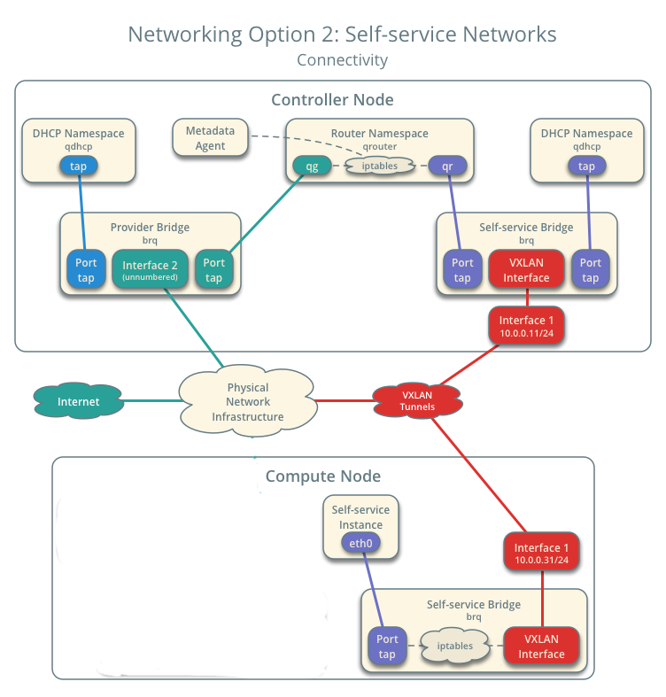
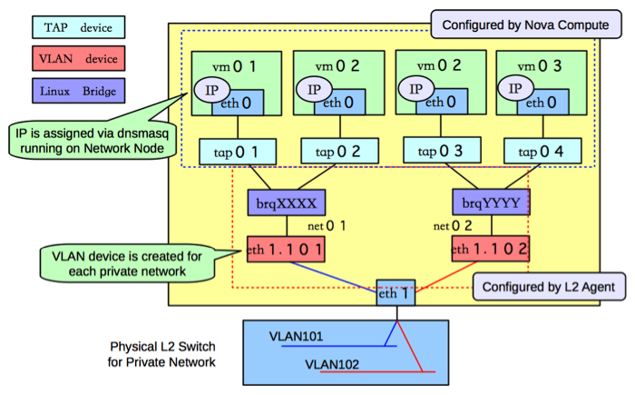

##Giới thiệu về dịch vụ mạng trong OpenStack
Một trong những yêu cầu quan trọng khi thiết lập một hệ thống đám mây là phải cung cấp cho các thành phần trong đám mây khả năng kết nối với nhau và kết nối ra bên ngoài, tức là cần thiết lập được một hệ thống mạng trong đám mây. Với đối tượng phục vụ kết nối mạng chính trong các đám mây là hệ thống máy ảo, đồng thời cùng với yêu cầu phải đảm bảo các tính chất của một đám mây- một hệ thống phân tán, OpenStack đã giải quyết bằng cách sử dụng một gói dịch vụ cho phép thiết lập một hệ thống mạng ảo trên đám mây. Gói dịch vụ cung cấp các dịch vụ mạng cho hệ thống OpenStack có tên là neutron.

Nhiệm vụ chính của dịch vụ Neutron là:

•	Tạo ra và quản lỷ các đối tượng và các thiết bị mạng ảo: router, switch, bridge, ip, subnet, network….

•	Sử dụng các thiết bị mạng ảo để xây dựng nên hệ thống mạng ảo, cung cấp dịch vụ mạng cho các dịch vụ và các đối tượng khác trong OpenStack.

•	Cung cấp các API cho phép người dùng thiết lập môi trường mạng cho và đánh địa chỉ cho môi trường mạng người đó thiết lập.

•	Cung cấp các dịch vụ liên quan tới mạng như cấp phát địa chỉ (DHCP), định tuyến (routing), DNS, cân bằng tải (Load-banlance)…

Chúng ta sẽ xem xét mô hình mạng ảo gồm những thành phần nào và được triển khai trên môi trường thực tế như thế nào.
##2 Mô hình hệ thống mạng ảo (virtual networking) trong OpenStack
###2.1 Các thành phần của hệ thống mạng ảo 
Để xây dựng nên hệ thống mạng ảo, chúng ta cần tạo ra các thiết bị mạng ảo tương ứng với các thiết bị mạng vật lý. Các thiết bị được ảo hóa là: Card mạng (Network Card Interfae –NIC), bridge, switch, router, DHCP, … Vai trò của từng thiết bị trong mạng cụ thể như sau:

•	NIC: Cổng kết nối internet, cung cấp kết nối mạng cho các máy ảo.

•	Bridge, switch: Kết nối các thiết bị  mạng và các máy ảo với nhau ở lớp Layer2 tạo thành các mạng cục bộ.

•	Router: Kết nối Các Switch với nhau để kết nối các mạng cục bộ với nhau và cung cấp kết nối internet cho các mạng cục bộ.

•	DHCP: Cấp phát địa chỉ IP cho các máy trong mạng.

Sau khi đã xác định được các thiết bị đã có trong mạng ảo, chúng ta sẽ sử dụng các thành phần này để triển khai trên các node tạo ra hạ tầng mạng. Có rất nhiều cách triển khai, ví dụ như sơ đồ sau là một cách triển khai hạ tầng trên network node:

Sau khi triển khai xong hạ tầng mạng ảo, các user có thể sử dụng các dịch vụ mà neutron cung cấp để xây dựng nên các mạng ảo cho project của user đó và cung cấp kết nối mạng cho các máy ảo trong project. 
###2.2 Ví dụ về một hệ thống mạng trong OpenStack cloud
Để hiểu rõ hơn về cách triển khai một hệ thống mạng trên OpenStack cloud, chúng ta cùng xem xét 1 ví dụ. Dưới đây là một hệ thống mạng self-service  được triển khai trên cấu hình vật lý gồm 1 node controller và một node compute.

Ở đây chúng ta sẽ triển khai một hệ thống mạng self service sử dụng linux-bridge làm L2 plugin, hệ thống này cho phép người dùng có thể tạo ra các mạng ảo riêng cho các project (private self-service network). Sơ đồ triển khai hệ thống mạng như sau:

Triển khai chi tiết trong compte node và controller node được thể hiện như sau:

Tại compute node:

Tại controller node:

Ở đây, chúng ta có thể thấy, một hệ thống mạng ảo được xây dựng dựa trên các thành phần thiết bị mạng ảo như Switch-Bridge, các card mạng (eth), router, dhcp,... Sau đó các thành phần thiết bị trên được triển khai trên các node tương ứng để cấu thành hệ thống mạng.

Ở trong mô hình hệ thống mạng self service, mỗi một mạng ảo (private network) do một user nào đó tạo ra đều có các thành phần được triển khai trên cả 2 node. Ví dụ, user tạo ra mạng khi mạng ảo net01,  1 bridge ảo được tạo ra trên controller node và 1 bridge ảo được tạo ra trên controller node. Bridge ảo trên controller node  và compute node sẽ được kết nối tới các card mạng vật lý, sao cho các card mạng vật lý này kết nối với nhau trong cùng một mạng. Như ở trong hình vẽ, thì cả card eth1 trong compute node và card eth1 trong controller node đều thuộc mạng vật lý private network. Nhờ đó, 2 bridge ảo được tạo ra sẽ kết nối với nhau tạo thành bộ khung cho mạng ảo chúng ta muốn tạo. Các bridge này kết nối với nhau bằng cách đánh địa chỉ VLAN, theo đó, thì mỗi 1 mạng ảo sẽ được triển khai trên 1 mạng VLAN, nhờ đó mà các mạng ảo này sẽ độc lập với nhau. Sau khi kết nối thành công các bridge được tạo ra trên các node với nhau, thì để cung cấp dịch vụ định tuyến và đánh địa chỉ cho mạng, một router ảo và một DHCP ảo được tạo ra trên controller node và kết nối với bridge ảo trên controller node. Tiếp đó, router sẽ đặt gateway lên mạng mạng provider network thông qua card mạng eth0 trên controller node. Mạng provider network kết nối với mạng internet, đo đó mạng ảo được tạo ra sẽ có thể kết nối được với internet thông qua router này.

Khi một máy ảo được tạo ra, người dùng sẽ phải xác định máy ảo đó sẽ thuộc mạng nào. Ví dụ ta muốn tạo ra một máy ảo VM01 thuộc mạng net 01 như trên hình vẽ. Khi đó service nova-compute sẽ tạo ra 1 card mạng ảo eth1 trên máy ảo VM01, card mạng eth1 này sau đó được kết nối với bridge brq trên compute node. Khi đó máy ảo VM01 sẽ kết nối được tới mạng ảo private net01.

